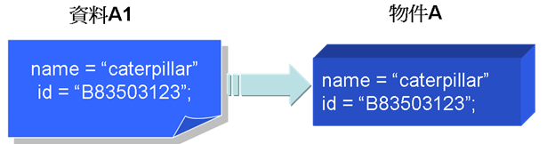
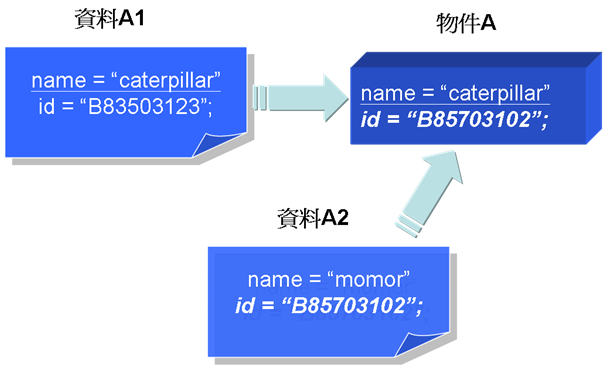
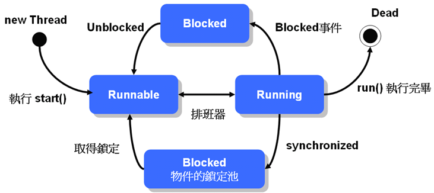
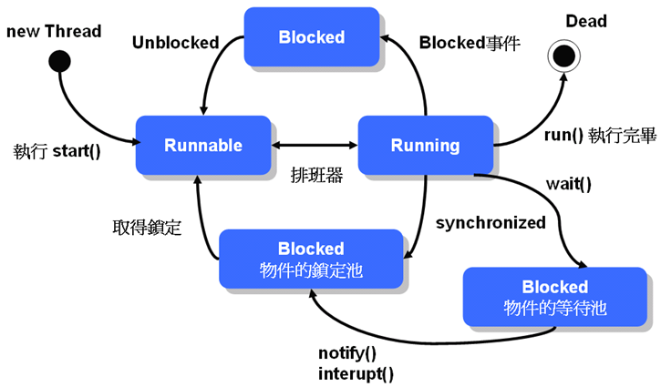

Concurrency
======
## Outline

- [前言](#前言)

- [Thread介紹](#Thread介紹)
	+ [Thread生命週期](#thread生命週期)	
	+ [Tread優先權](#thread優先權)
	+ [Thread的使用方法](#thread的使用方法)
		* [繼承Thread類別](#繼承thread類別)
		* [實做Runnable介面](#實做runnable介面)
	+ [Daemon執行緒](#daemon執行緒)
	+ [Thread的加入(Join)](#thread的加入)
	+ [Thread的停止](#thread的停止)
	+ [ThreadGroup](#threadgroup)
	+ [使用Executors](#使用executors)
	
- [同步化議題](#同步化議題)
	+ [同步化](#同步化)
	+ [Thread等待與喚醒](#thread等待與喚醒)
	+ [生產者與消費者](#生產者與消費者)
	+ [容器類的執行緒安全（Thread-safe）](#容器類的執行緒安全)
	+ [ThreadLocal類別](#threadlocal類別)
	+ [concurrent套件新增類別](#concurrent套件新增類別)
		* [BlockingQueue](#blockingqueue)
		* [Callable與Future](#callable與future)
	
- [參考文獻](#參考文獻)

## 前言

單執行緒程式指的是，當我們啟動一個Java程式，而這個Java程式在『同時間只會做一件事』。而多執行緒(Multi-thread）程式
指的是程式『同時間做很多事』，例如Web瀏覽程式可以在下載網頁的同時，顯示動畫、播放音樂、捲動式窗瀏覽網頁內容。
本章除了討論要如何實做Thread程式，也會探討如執行緒生命週期、執行緒安全(Thread-safe)，和同步化（Synchronized）等問題。


## Thread介紹
首先，先來釐清什麼是program、process、thread。

Program : 一群程式碼的集合，用以解決特定的問題。以物件導向的觀念來類比，相當於Class。


Process : Program載入記憶體後所產生的可執行檔，一個Program可以同時執行多次,產生多個Process。以物件導向的觀念來類比，相當於Object。
每一個process由以下兩個項組成：
- 一個Memory Space。相當於Object的variable,不同Process的Memory Space也不同,彼此看不到對方的Memory Space。
- 一個以上的Thread。Thread代表從某個起始點開始(例如main),到目前為止所有函數的呼叫路徑,以及這些呼叫路徑上所用到的區域變數。


Thread : 又稱為(Lightweight Process)，是process裡單一而連續的控制流程(flow of control)，一個process可以同時包含多個thread，稱為multi-thread
也就是說一個程式可同時進行多個不同的子流程，每個子流程可以得到一小段程式的執行時間，每執行完一個thread就跳下一個thread，
由於轉換的速度很快，看起來就像一個程式可以同時處理多個事務。每個thread都有一個優先值(priority)，priority較高的先執行。
每一個thread由以下兩項組成：
- Stack:紀錄函數呼叫路徑，以及這些函數所用到的區域變數。
- 目前CPU的狀態	


整理Thread的重點如下：
- 一個process可有多個thread，這些thread共用process的memory space，但每個thread有各自的stack。
- Thread不能單獨存在或獨立執行，一定隸屬於程式，由程式來啟動thread。
- 作業系統會根據thread的優先權以及已經用掉的CPU時間,在不同的thread作切換,讓各個thread都有機會執行。
- main()方法就是一個thread，所以每個process一定至少包含一個thread。 

### Thread生命週期

下圖是基本的Thread生命週期狀態：


當實例化一個 Thread 並執行 start() 之後，執行緒進入 Runnable 狀態，此時執行緒尚未真正開始執行，必須等待排班器（Scheduler）的排班，被排入執行的執行緒才會執行 run() 方法中的定義。

雖然執行緒看起來像是同時執行，但事實上同一時間點上，還是只有一個執行緒在動作，只是執行緒之間切換的動作很快，所以看來像是同時執行。

有幾種狀況會讓執行緒進入 Blocked 狀態：
- 等待輸入輸出完成
- 呼叫 sleep() 方法
- 嘗試取得物件鎖定
- 呼叫 wait() 方法

當執行緒因為等待使用者的文字輸入、傾聽網路連線或以上等情況時，會阻止它的執行而進入 Blocked 狀態，執行緒排班器將不分配執行時間給這個執行緒，直到以下的幾個對應情況讓執行緒回到 Runnable 狀態：
- 輸入輸出完成
- 呼叫 interrupt()
- 取得物件鎖定
- 呼叫 notify() 或 notifyAll()

最後，如果執行的工作完成（或發生例外）而離開 run() 方法，則執行緒執行完畢，進入 Dead 狀態，您可以使用 isAlive() 方法來測試執行緒是否存活。

### Thread優先權
Thread.setPriority(int)可以設定Thread的優先權,數字越大優先權越高。
您可以使用 Thread 的 setPriority() 方法來設定執行緒的優先權，設定必須在 1 到 10 之間，否則會丟出 IllegalArgumentException。
Thread定義了3個相關的static final variable
- public static final int MAX_PRIORITY 10
- public static final int MIN_PRIORITY 1
- public static final int NORM_PRIORITY 5 

當優先權有高有低的不同執行緒都進入生命週期中的Runnable狀態時(例如I/O輸入完畢)，JVM會先讓高優先權的執行緒執行，
但是在支援時間分割的作業系統下，優先權高的執行緒完成之前，較低優先權的執行緒仍然會分配到執行的時間。

使用優先權時，有件事要注意：
java分成十種優先權等級，但是各種作業系統的優先權分級未必和java相同，例如Windows就只有七種。
實際運作時，JVM會將程式重新對映到作業系統的優先權等級。
因此不同的優先權重新對映後有可能會沒有差別，如果執行緒的優先權一定要實質差距，可以使用上面提到的MAX、NORM、MIN來設定。

若是優先權相同時則依排程演算法輪流執行，如使用Round-Robin。
- 註(Round-Robin演算法)：首先，作業系統會定義一個時間單位，稱作time quantum或是time slice，長度通常在10~100毫秒。當程序(process)準備好能執行時(Ready)，會排入一個佇列(queue)的尾端，這佇列稱為ready queue。 CPU排程器會不斷地取出排在ready queue前端的程序，並且設定計時器在一個時間單位之後，自動去中斷程序。 

### Thread的使用方法
想要讓物件能具有多執行緒（Multi-thread）功能，只要繼承 java.lang.Thread 類別或是實作 java.lang.Runnable 介面。

#### 繼承Thread類別
在 Java 中要實現執行緒功能，可以繼承 java.lang.Thread 類別，並重新定義 run() 方法，
要使用時則new一個執行緒物件，然後使用 start() 方法啟動該執行緒。

範例1：
```java
package DemoThread;

class Person extends Thread{
	public Person(String name) { // name會成為新thread的名稱
		super(name) ; 
	}
	
	public void run() {
		String name = Thread.currentThread().getName(); // 取得thread的名稱
		int priority = Thread.currentThread().getPriority() ; // 取得thread的優先序
		Thread.State state = currentThread().getState() ; // 取得thread的狀態
		
		System.out.println(name + "的優先序:" + priority + "; 狀態:" + state ) ;
		
		for( int i = 1 ; i <= 5 ; i++ ) {
			System.out.println(name + "跑完第" + i + "圈") ;
			if ( name.equals("Ken") && i%3 == 0 ) { // Ken thread每跑三圈休息一秒
				System.out.println(name + "休息1秒") ;
				try{
					Thread.sleep(1000); // 暫停目前的thread1000毫秒
				}
				catch (InterruptedException e) {
					e.printStackTrace();
				} // catch
			} // if
		} // for
	} // run()
} // Person

public class DemoSampleThread {

    public static void main(String[] args) {
    	Person allen = new Person("Allen") ;
    	Person ken = new Person("Ken") ;
    	
    	allen.start(); // 啟動thread，並呼叫run()方法
    	// allen.start() ; // 已經啟動不能再呼叫start()方法
    	// ken.run() ; // 直接呼叫run()而略過start()不會開啟新的thread，而是由主執行緒去執行run()內容
    	
    	ken.start();
    	System.out.println("執行緒個數:" + Thread.activeCount()) ;
    	// 要注意的是，每次的執行結果不一定相同
    }

}


```

當您使用 Thread.sleep() 讓執行緒暫停執行進入 Blocked 狀態，您可以使用 interrupt() 讓它離開 Blocked 狀態，
當使用 sleep() 暫時進入 Blocked 狀態而您 interrupt() 時，會丟出 java.lang.InterruptedException 例外物件。

#### 實做Runnable介面
在Java裡一次只能繼承一個類別，所以當我們已經繼承了某類別，就不能繼承Thread類別，
這時候我們可以實做 java.lang.Runnable 介面來定義具執行緒功能的類別，
使用時一樣要先產生 Thread 類別的實例，只是要拿實作 Runnable 介面的物件實例，當成 Thread 類別建構子的參數
可參考父類別Thread的建構子參數：
- Thread()
- Thread(String name)
- Thread(Runnable target)
- Thread(Runnable target, String name)


範例2:
```java
package DemoRunnable;

class Person implements Runnable {
	public void run() {
		String name = Thread.currentThread().getName() ;
		
		for ( int i = 1 ; i < 5 ; i++ ) {
			System.out.println(name + "跑完第" + i + "圈") ;
			if ( name.equals("Ken") && i%3 == 0 ) {
				System.out.println(name + "稍為暫停" ) ;
				Thread.currentThread().yield(); // 讓該執行續暫停一下，先讓其他執行緒執行
			} // if
		} // for
	} // run
} // Person

public class DempSampleRunnable {

	public static void main(String[] args) {
		Person allen = new Person() ; // Person類別實做Runnable介面，所以Person物件就是Runnable物件
		Person ken = new Person() ;
		Thread tAllen = new Thread( allen, "Allen" ) ; // 呼叫Thread建構式，將Runnable物件allen傳入已建立Thread物件tAllen
		Thread tKen = new Thread( ken, "Ken" ) ;
		tAllen.start(); // 開啟執行緒並執行run方法
		tKen.start(); 
		
		try { // 主執行緒必須等到tAllen、tKen執行完畢才可以繼續進行
			tAllen.join();
			System.out.println("Join tAllen.") ;
			
			tKen.join();
			System.out.println("Join tKen.") ;
		}
		catch( InterruptedException e ) {
			e.printStackTrace();
		}
		
		System.out.println("跑步訓練結束") ;

	}

}

```

### Daemon執行緒
Daemon這個字的原意是在UNIX系統下獨立在幕後執行的程式，在Java的多執行緒設定中借用為背景執行緒。 
Daemon執行緒和一般執行緒只有一個差別，那就是當JVM底下只剩Daemon執行緒在運作時，JVM會直接關閉。JVM關閉之後，這些Daemon執行緒當然也會隨之結束。
換句話說，Daemon執行緒不能單獨生存在沒有一般執行緒的環境下。除此之外，Daemon執行緒和一般執行緒完全沒有任何差別。

範例3:
```java
package DemoDaemonThread;

public class DemoDaemonThread {

    public static void main(String[] args) {

    	System.out.println("Main Start.") ;
        Thread thread = new Thread(
        // 這是匿名類別的寫法
            new Runnable() {
                public void run() { 
                    while(true) { 
                        System.out.print("T"); 
                    } 
                }        
            }); 
        
        // 設定為Daemon執行緒
        thread.setDaemon(true); 
        thread.start(); 
        System.out.println("Main End.") ;
    }

}

```

這個程式在主執行緒結束之後，Daemon 執行緒也就會跟著結束，您可以使用 setDaemon() 方法來設定一個執行緒是否為 Daemon 執行緒，
如果沒有使用 setDaemon() 設定為 true，則程式會不斷的印出 'T' 字元而不終止；使用 isDaemon() 方法則可以判斷該執行緒是否為 Daemon 執行緒。

Java 預設所有從 Daemon 執行緒產生的執行緒也是 Daemon 執行緒，因為基本上由一個背景服務執行緒衍生出來的執行緒，
也應該是為了在背景服務而產生的，所以在產生它的執行緒停止的話，也應該一併跟著停止。


### Thread的加入

如果有一個A執行緒正在運行，您希望插入一個B執行緒，並要求 B 執行緒先執行完畢，然後再繼續 A 執行緒的流程，
可以使用 join() 方法來完成這個需求，當執行緒使用 join() 加入至另一個執行緒時，另一個執行緒會等待這個被加入的執行緒工作完畢，
然後再繼續它的動作，join() 的意思表示將執行緒加入成為另一個執行緒的流程之一。

範例4:
```java
package DemoThreadJoin;

public class DemoThreadJoin {

    public static void main(String[] args) {
        System.out.println("Thread A 執行");

        Thread threadB = new Thread(new Runnable() { 
            public void run() { 
                try { 
                    System.out.println("Thread B 開始.."); 
                    for(int i = 0; i < 5; i++) { 
                        Thread.sleep(1000); 
                        System.out.println("Thread B 執行.."); 
                    }
                    System.out.println("Thread B 即將結束.."); 
                } 
                catch(InterruptedException e) { 
                    e.printStackTrace(); 
                } 
            } 
        });

        threadB.start();

        try {
            // Thread B 加入 Thread A
            threadB.join();
        } 
        catch(InterruptedException e) { 
            e.printStackTrace(); 
        } 

        System.out.println("Thread A 執行");
    }

}

```
程式啟動後主執行緒就開始，在主執行緒中您新建 threadB，並在啟動 threadB 後，將之加入（join）主執行緒的流程之中，
所以 threadB 必須先執行完畢，主執行緒才會再繼續它原本的流程，如果程式中 threadB 沒有使用 join() 將之加入主執行緒的流程中，
則最後一行顯示 "Thread A 執行" 的陳述會先執行完畢（因為 threadB 使用了 sleep()，這讓主執行緒有機會取得時間來執行）。 
有時候加入的執行緒有可能處理太久，您不想無止境的等待這個執行緒的工作完畢，則您可以在 join() 上指定時間，
例如 join(10000)，表示加入成為流程之一的執行緒至多處理 10000 毫秒，也就是 10 秒，如果加入的執行緒還沒執行完畢就不理它了，
目前的執行緒可以繼續執行原本的工作流程。

### Thread的停止
如果您想要停止一個執行緒，您最好自行實作，一個執行緒要進入 Dead 狀態，就是執行完 run() 方法，簡單的說，如果您想要停止一個執行緒的執行，
就要提供一個方式讓執行緒可以完成 run() 的流程， 而這也是您自行實作執行緒停止的基本概念。

```java
public class SomeThread implements Runnable { 
    private boolean isContinue = true; 
    public void terminate() { 
        isContinue = false; 
    } 
    public void run() { 
        while(isContinue) { 
            // ... some statements 
        } 
    } 
}
```


如果執行緒因為執行 sleep() 而進入 Blocked 狀態，而您想要停止它，您可以使用 interrupt()，而程式會丟出 InterruptedException 例外，因而使得執行緒離開 run() 方法。

```java
public class SomeThread implements Runnable {
    public void run() { 
        System.out.println("sleep....至 blocked 狀態"); 
        try { 
            Thread.sleep(9999); 
        } 
        catch(InterruptedException e) { 
            System.out.println("I am interrupted...."); 
        } 
    } 

    public static void main(String[] args) { 
        Thread thread = 
                 new Thread(new SomeThread()); 
        thread.start(); 
        thread.interrupt(); 
    } 
}
```

### ThreadGroup
在 Java 中每個執行緒都屬於某個「執行緒群組」（ThreadGroup）管理的一員，例如若您是在 main() 主工作流程中產生一個執行緒，則產生的執行緒屬於 main 這個執行緒群組管理的一員，
您可以使用下面的指令來取得目前執行緒所屬的執行緒群組名稱：

```java
Thread.currentThread().getThreadGroup().getName();
```

每一個執行緒產生時，都會被歸入某個執行緒群組，這視您的執行緒是在哪個群組中產生，如果沒有指定，則歸入產生該子執行緒的執行緒群組中，您也可以自行指定執行緒群組，執行緒一但歸入某個群組，就無法更換群組。

java.lang.ThreadGroup 類別正如其名，可以統一管理整個群組中的執行緒，您可以使用以下的方式來產生群組，並在產生執行緒的時候，一併指定其群組：


```java
ThreadGroup threadGroup1 = new ThreadGroup("group1");
ThreadGroup threadGroup2 = new ThreadGroup("group2");
Thread thread1 = 
          new Thread(threadGroup1, "group1's member");
Thread thread2 = 
           new Thread(threadGroup2, "group2's member");
```

ThreadGroup 中的某些方法，可以對所有的執行緒產生作用，例如 interrupt() 方法可以 interrupt 群組中所有的執行緒，setMaxPriority() 方法可以設定群組中執行緒所能擁有的最大優先權（本來就擁有更高優先權的執行緒不受影響）。

如果您想要一次取得群組中所有的執行緒來進行某種操作，您可以使用 enumerate() 方法，例如：
```java
Thread[] threads = new Thread[threadGroup1.activeCount()];
threadGroup1.enumerate(threads);
```

activeCount() 方法取得群組中作用中的執行緒數量，enumerate() 方法要傳入一個 Thread 陣列，它會將執行緒物件設定至每個陣列欄位中，之後您就可以指定陣列索引來操作這些執行緒。

### 使用Executors
Thread Pool 的概念如同其名，就是一個 Thread 的 Pool，
其中有固定或變動量的 Thread，當 request 進來時，若有閒置的 Thread 就執行，
若沒有的話，可能產生新的 Thread 或把 request 放入 queue 中等待被執行，
當一條 Thread 執行完工作而 queue 中仍有 request 在等待時，
此 Thread 應該要被分發新的 request 並處理。

由以上幾行，我們可以看出 Thread Pool 的工作有：
- 管控 Thread 的產生與回收
- 分發 Thread 處理 request
- 處理 request 的 queue

使用Executors能為你管理Thread物件，進而簡化並行程式設計撰寫。Executors提供的是用戶端與執行任務之間的中介層，讓中介物件
執行任務，而不是讓用戶端直接執行。Executors可以讓你管理非同步任務的執行，而無需自行管理Thread的生命週期。

範例5:
```java
package DemoExecutor ;

import java.util.concurrent.Executor;
import java.util.concurrent.Executors;
 
 public class ThreadPoolDemo {
 
     public static void main(String[] args) {
         
         // 建立 2 個 thread 的 thread pool
         Executor executor = Executors.newFixedThreadPool(2);  
         
         // 執行實作了 Runnable 介面的內部類別 Work
         executor.execute(new Work(1));  
         executor.execute(new Work(2));  
         executor.execute(new Work(3));  
 
         // 直接在 function 中宣告匿名內部類別
         executor.execute(new Runnable() {
             // anonymous inner class            
             @Override
             public void run() {
                 System.out.println(Thread.currentThread().getName() + 
                     " Begins Work in anonymous inner class.");  
             }
         });
     }
     
     public static class Work implements Runnable {  
         private int id;  
       
         public Work (int id) {  
             this.id = id;  
         }  
       
         public void run() {  
             System.out.println(Thread.currentThread().getName() + 
                 " Begins Work " + id);  
             try {  
                 Thread.sleep(1000);  
             }  
             catch (InterruptedException ex) {  
                 ex.printStackTrace();  
             }  
             System.out.println(Thread.currentThread().getName() + 
                 " Ends Work " + id);  
         }  
     }  
 }
```

由以上的程式中我們可以發現，
Thread Pool 的 Thread 生命週期、request queue、分發request 都被 Java 做掉了，
我們所要做的就只有設定 Thread 的數量和專注在工作的內容。

另外除了固定 Thread 數量的 Thread Pool 可用 Executors.newFixedThreadPool() 外，
Executors 也提供了其他的 method 來產生不同的 Thread Pool，如：
- SingleThreadExecutor
- CachedThreadPool
- ScheduledThreadPool
- SingleThreadScheduledExecutor 

## 同步化議題

### 同步化

如果程式只是一個單執行緒，單一流程的程式，那麼只要注意到程式邏輯的正確，程式通常就可以正確的執行您想要的功能，
但當程式是多執行緒程式，多流程同時執行時，那麼就要注意到更多的細節，例如在多執行緒共用同一物件的資料時。

如果一個物件所持有的資料可以被多執行緒同時共享存取時，您必須考慮到「資料同步」的問題，所謂資料同步指的是兩份資料的整體性、一致性，
例如物件 A 有 name 與 id 兩個屬性，而有一份 A1 資料有 name 與 id 的資料要用來更新物件A的屬性，如果 A1 的 name 與 id 設定給 A 物件完成，
則稱 A1 與 A 同步：



如果 A1 資料在更新了物件的 name 屬性時，突然插入了一份 A2 資料更新了 A 物件的 id 屬性，則顯然的 A1 資料與 A 就不同步，A2 資料與 A 也不同步。



下面是個簡單的範例，看看在多執行緒共用資料時會發生什麼問題。

範例6：
```java
package DemoSynchronized;

class PersonalInfo {
    private String name; 
    private String id; 
    private int count; 

    public PersonalInfo() { 
       name = "nobody"; 
       id = "N/A"; 
    } 

    public void setNameAndID(String name, String id) { 
       this.name = name; 
       this.id = id; 
       if(!checkNameAndIDEqual()) {
           System.out.println(count + 
                   ") illegal name or ID.....");
       } 
       count++; 
    } 

    private boolean checkNameAndIDEqual() { 
       return (name.charAt(0) == id.charAt(0)) ? 
                             true : false; 
    } 
}

public class PersonalInfoTest {
    public static void main(String[] args) {
        final PersonalInfo person = new PersonalInfo(); 

        // 假設會有兩個執行緒可能更新person物件
        Thread thread1 = new Thread(new Runnable() { 
           public void run() { 
              while(true) 
                  person.setNameAndID("Justin Lin", "J.L"); 
           } 
        }); 

        Thread thread2 = new Thread(new Runnable() { 
            public void run() { 
               while(true) 
                   person.setNameAndID("Shang Hwang", "S.H");    
            } 
        }); 

        System.out.println("開始測試....."); 

        thread1.start(); 
        thread2.start();
    }
} 

```

雖然傳遞給 setNameAndID() 的引數並沒有問題，在某個時間點時，thread1 設定了 "Justin Lin", "J.L" 給 name 與 id，在進行 if 測試的前一刻，
thread2 可能此時剛好呼叫 setNameAndID("Shang Hwang", "S.H")，在 name 被設定為 "Shang Hwang" 時，checkNameAndIDEqual() 
開始執行，「此時 name 等於 "Shang Hwang"，而 id 還是 "J.L"」，所以 checkNameAndIDEqual() 就會傳回 false，結果就顯示了錯誤訊息。

當一個執行緒正在設定物件資料時，另一個執行緒不可以同時進行設定，這樣的情況我們稱為race condition。
為了解決執行緒衝突的問題，幾乎所有並行性機制都會循序化對資源的存取。也就是說同一時間只允許一個任務通過該程式碼的程式碼區段來達成。
因為這樣的區段會產生互斥(mutual exclusion)的效應，所以這樣的機制有個共通的名稱是mutex。

為了避免資源的衝突，Java以"synchronized" 關鍵字的形式來提供內建的支援。當一個任務想要執行一段受synchronized關鍵字所保護的程式碼時，
他會先檢察看lock是否可用，接著在取得lock後執行程式碼，最後釋放lock。

要注意的是，當使用到並行性時，將變數宣告為private就變的格外重要，若是將變數宣告為public/protected，物件在外界可以繞過同步方法的控制
值直接取得並改變他，那麼就會引發衝突。

把"synchronized" 關鍵字用於方法上，讓方法的範圍（Scope）內都成為同步化區域，例如：
```java
public synchronized void setNameAndID(String name, String id) { 
    this.name = name; 
    this.id = id; 
    if(!checkNameAndIDEqual()) {
       System.out.println(count + 
               ") illegal name or ID.....");
    } 
    count++; 
}
```

所有物件天生都具備一個lock(也可稱為monitor)，物件的這個鎖定在平時是沒有作用的。
被標示為 "synchronized" 的方法會成為同步化區域，當執行緒執行某個物件的同步化區域時，物件的lock就有作用了，
想要執行同步化區域的執行緒，都必須先取得物件的lock，執行完同步化區域之後再將lock歸還給物件。

因為物件的lock只有一個，當有個執行緒已取走lock而正在執行同步化區域中的程式碼時，
若有其它執行緒也想執行 "synchronized" 的區域，因為其它執行緒無法取得lock，所以只好在物件的鎖定池（Lock Pool）等待，
直到lock被前一個執行緒歸還為止，此時在lock pool中的執行緒競爭被歸還的物件lock，只有取得lock的執行緒才能進入 Runnable 狀態，
等待排班器排班並執行同步化區域。 說明到這邊，可以畫出如下圖的執行緒狀態圖：



同步化的區域在有一個執行緒佔據時就像個禁區，不允許其它執行緒進入，由於同時間只能有一個執行緒在同步化區域，所以更新共享資料時，
就有如單執行緒程式在更新資料一樣，藉此保證物件中的資料會與給定的資料同步。

另外，"synchronized" 的設定不只可用於方法上，也可以用於限定某個程式區塊為同步化區域，即為所謂的關鍵區(Critical sections)，例如：
```java
public void setNameAndID(String name, String id) { 
    synchronized(this) {
        this.name = name; 
        this.id = id; 
        if(!checkNameAndIDEqual()) {
           System.out.println(count + 
               ") illegal name or ID.....");
        } 
        count++; 
    }
}
```

這個程式片段的意思就是，在執行緒執行至 "synchronized" 設定的同步化區塊時取得物件lock，
這麼一來就沒有其它執行緒可以來執行這個同步化區塊，這個方式可以應用於不想鎖定整個方法區塊，
而只是想在更新共享資料時再確保物件與資料的同步化，由於同步化區域只是方法中的某個區塊，
在執行完區塊後執行緒即釋放對物件的lock，以便讓其它執行緒有機會競爭物件的lock，
相較於將整個方法區塊都設定為同步化區域會比較有效率。

您也可以標示某個物件要求同步化，例如在多執行緒存取同一個 ArrayList 物件時，由於 ArrayList 並沒有實作資料存取時的同步化，
所以當它使用於多執行緒環境時，必須注意多個執行緒存取同一個 ArrayList 時，有可能發生兩個以上的執行緒將資料存入 ArrayList 的同一個位置，
造成資料的相互覆蓋，為了確保資料存入時的正確性，您可以在存取 ArrayList 物件時要求同步化，例如：

```java
// arraylist參考至一個ArrayList的一個實例 
synchronized(arraylist) {
    arraylist.add(new SomeClass()); 
}
```

同步化確保資料的同步，但所犧性的就是在於一個執行緒取得物件鎖定而佔據同步化區塊，而其它執行緒等待它釋放鎖定時的延遲，
在執行緒少時可能看不出來，但在執行緒多的環境中必然造成一定的效能問題（例如大型網站的多人連線時）。

### 不可切割性automicity與易變性volatility

不可切割性(Automic operation):就是不能被執行序排程器所中斷的操作，一旦操作開始，就一定會再context switch之前執行完畢。
- 舉例來說,當我們在 Java 中執行宣告 int i = 12 會配置 32 bits 的記憶體空間並將 12 這個值寫到記憶體區塊中,將整數 12 寫入記憶體這個操作是一個 Atomic Operation,不會只做一半就被其他操作中斷,而影響指派(assignment)值的正確性

不可切割性是用在longs和doubles以外的基本型別所施加的基本操作。long和double例外的原因是，Java規格書不禁止這兩種64位元資料的修改過程以兩次32位元的寫入來完成。
如果在兩次寫入或分批讀取的過程中受到干擾，就可能出現完全超乎意料的數字。

例如A執行緒不斷設定某個double變數num為5、B則不斷地設定為10，
最後卻有可能因為執行緒彼此干擾寫入結果，使得num讀取出不同於5或10的數字！

所幸，double和long型態的存取，都可以使用volatile修飾，迫使它們不可分割。(要注意的是volatile在Java SE5之前的版本上無法正確運作)

### ThreadLocal類別
無論如何，要編寫一個多執行緒安全（Thread-safe）的程式總是困難的，為了讓執行緒共用資源，您必須小心的對共用資源進行同步，
同步帶來一定的效能延遲，而另一方面，在處理同步的時候，又要注意物件的鎖定與釋放，避免產生死結，種種因素都使得編寫多執行緒程式變得困難。

嘗試從另一個角度來思考多執行緒共用資源的問題，既然共用資源這麼困難，那麼就乾脆不要共用，何不為每個執行緒創造一個資源的複本，
將每一個執行緒存取資料的行為加以隔離，實現的方法就是給予每一個執行緒一個特定空間來保管該執行緒所獨享的資源，
在 Java 中您可以使用 java.lang.ThreadLocal 來實現這個功能，這個類別是從 JDK 1.2 之後開始提供，不過這邊要先來看看，
如何自行實現一個簡單的 ThreadLocal 類別。

範例8:
```java
import java.util.*;

public class ThreadLocal<T> {
    // 取得一個同步化的Map物件
    private Map<Thread, T> storage = 
             Collections.synchronizedMap(new HashMap<Thread, T>());

    public T get() {
        // 取得目前執行get()方法的執行緒
        Thread current = Thread.currentThread();
        // 根據執行緒取得執行緒自有的資源
        T t = storage.get(current);

        // 如果還沒有執行緒專用的資源空間
        // 則建立一個新的空間
        if(t == null && 
           !storage.containsKey(current)) {
            t = initialValue();
            storage.put(current, t);
        }

        return t;
    }

    public void set(T t) {
        storage.put(Thread.currentThread(), t);
    }

    public T initialValue() {
        return null;
    }
}
```

範例中您使用執行緒作為「鍵」（Key），並將所獲得的資源物件放在Map物件中，如果第一次使用get()，您也配置一個空間給執行緒，
而 initialValue() 可以用來設定什麼樣的初值要先儲存在這個空間中，在範例中先簡單的設定為 null。 
現在假設有一個原先在單執行緒環境下的資源 SomeResource，現在考慮要在多執行緒環境下使用，
您不想考慮複雜的執行緒共用互斥問題，此時可以使用 ThreadLocal 類別來使用 SomeResource，例如：
範例9:
```java
public class Resource {
    private static final 
       onlyfun.caterpillar.ThreadLocal<SomeResource> threadLocal = 
            new onlyfun.caterpillar.ThreadLocal<SomeResource>();
    public static SomeResource getResource() {
        // 根據目前執行緒取得專屬資源
        SomeResource resource = threadLocal.get();
        // 如果沒有取得目前專屬資源
        if(resource == null) {
            // 建立一個新的資源並存入ThreadLocal中
            resource = new SomeResource();
            threadLocal.set(resource);
        }
        return resource;
    }
}
```

以上所實作的 ThreadLocal 類別只是一個簡單的示範，在 Java 中您可以直接使用 java.lang.ThreadLocal，
在這邊簡單的示範一個記錄（Log）程式，它可以記錄每個執行緒的活動。
```java
package DemoThreadLogger;

import java.io.*;
import java.util.logging.*;                            

class SimpleThreadLogger {
    private static final 
        java.lang.ThreadLocal<Logger> threadLocal = 
                  new java.lang.ThreadLocal<Logger>();
    // 輸出訊息
    public static void log(String msg) {
        getThreadLogger().log(Level.INFO, msg);
    }
    // 根據執行緒取得專屬Logger
    private static Logger getThreadLogger() {
        Logger logger = threadLocal.get();

        if(logger == null) {
            try {
                logger = Logger.getLogger(
                           Thread.currentThread().getName());
                // Logger 預設是在主控台輸出
                // 我們加入一個檔案輸出的Handler
                // 它會輸出XML的記錄文件
                logger.addHandler(
                    new FileHandler(
                           Thread.currentThread().getName() 
                           + ".log"));
            }
            catch(IOException e) {}

            threadLocal.set(logger);
        }

        return logger;
    }
}

public class LoggerTest {
    public static void main(String[] args) {
        new TestThread("thread1").start();
        new TestThread("thread2").start();
        new TestThread("thread3").start();
    }
}

class TestThread extends Thread {
    public TestThread(String name) {
        super(name);
    }

    public void run() {
        for(int i = 0; i < 10; i++) {
            SimpleThreadLogger.log(getName() + 
                                     ": message " + i);
            try {
                Thread.sleep(1000);
            }
            catch(Exception e) {
                SimpleThreadLogger.log(e.toString());
            }
        }
    }
}
```

執行之後，您可以在主控台上看到輸出，並可以在同一目錄下找到三個 .log 檔，分別記錄了三個執行緒的活動，
透過 ThreadLocal，您不用撰寫複雜的執行緒共用互斥邏輯，其意義在於：「有時不共用是好的」。如果共用會產生危險，
那就不要共用，當然，這種方式所犧牲掉的就是空間，您必須為每一個執行緒保留它們獨立的空間，
這是一種以空間換取時間與安全性的方法。

### Thread等待與喚醒

死結(Deadlock):正在懸置狀態的thread再也無法改變他的狀態，因為他所要的資源被另一個也再懸置的thread占用，最後造成餓死(starvation)。
死結在程式執行時期不會出現例外，因為死結在城市中屬於非程式執行時期的錯誤，而這種錯誤系統會以正常情況看待，所以應小心避免。
因此需要利用wait()、notify()協調。

wait()、notify() 與 notifyAll() 是 由Object 類別所提供的方法，您在定義自己的類別時會繼承下來，
wait()、notify() 與 notifyAll() 都被宣告為 "final"，所以無法重新定義它們，透過 wait() 方法可以要求執行緒進入物件的等待池（Wait Pool），
或是通知執行緒回到鎖定池的 Blocked 狀態。

您必須在同步化的方法或區塊中呼叫 wait() 方法（也就是執行緒取得鎖定時），當物件的 wait() 方法被調用，目前的執行緒會被放入物件的等待池中，
執行緒歸還物件的鎖定，其它的執行緒可競爭物件的鎖定；被放在等待池中的執行緒也是處於 Blocked 狀態，所以不參與執行緒的排班。

wait() 可以指定等待的時間，如果指定時間的話，則時間到之後執行緒會再度回到鎖定池的 Blocked 狀態，等待競爭物件鎖定的機會，
如果指定時間 0 或不指定，則執行緒會持續等待，直到被中斷（interrupt），或是被告知（notify）回到鎖定池的 Blocked 狀態。


當物件的 notify() 被調用，它會從目前物件的等待池中通知「一個」執行緒加入回到鎖定池的 Blocked 狀態，被通知的執行緒是隨機的，
被通知的執行緒會與其它執行緒共同競爭物件的鎖定；如果您呼叫 notifyAll()，則「所有」在等待池中的執行緒都會被通知回到鎖定池的 Blocked 狀態，
這些執行緒會與其它執行緒共同競爭物件的鎖定。

簡單的說，當執行緒呼叫到物件的 wait() 方法時，表示它要先讓出物件的鎖定並等待通知，或是等待一段指定的時間，
直到被通知或時間到時再與其它執行緒競爭物件的鎖定，如果取得鎖定了，就從等待點開始執行。

notify()&notifyAll()比較：

notify():
- 目的：僅喚醒一個正在等待狀態的thread。
- 缺點：當有多個thread等待被喚醒時，由JVM決定哪一個thread出線，開發人員無法控制，出線的依歸不一定是由priority決定，而是JVM的運算法則為準。

notifyAll():
- 目的：喚醒所有正在等待狀態的thread。
- 缺點：依序喚醒的順序也由JVM決定。


### 生產者與消費者

說明 wait()、notify()或notifyAll() 應用最常見的一個例子，就是生產者（Producer）與消費者（Consumer）的例子：
生產者會將產品交給店員，而消費者從店員處取走產品，店員一次只能持有固定數量產品，如果生產者生產了過多的產品，
店員叫生產者等一下（wait），如果店中有空位放產品了再通知（notify）生產者繼續生產，如果店中沒有產品了，
店員會告訴消費者等一下（wait），如果店中有產品了再通知（notify）消費者來取走產品。

以下舉一個最簡單的：生產者每次生產一個 int 整數交給店員，而消費者從店員處取走整數，店員一次只能持有一個整數。

範例7:

Clerk.java
```java
package ProducerAndConsumer;

public class Clerk {
    // -1 表示目前沒有產品
    private int product = -1; 

    // 這個方法由生產者呼叫
    public synchronized void setProduct(int product) { 
        if(this.product != -1) { 
            try { 
                // 目前店員沒有空間收產品，請稍候！
                wait(); 
            } 
            catch(InterruptedException e) { 
                e.printStackTrace(); 
            } 
        } 

        this.product = product; 
        System.out.printf("生產者設定 (%d)%n", this.product); 

        // 通知等待區中的一個消費者可以繼續工作了
        notify(); 
    } 

    // 這個方法由消費者呼叫
    public synchronized int getProduct() { 
        if(this.product == -1) { 
            try { 
                // 缺貨了，請稍候！
                wait(); 
            } 
            catch(InterruptedException e) { 
                e.printStackTrace(); 
            } 
        } 

        int p = this.product; 
        System.out.printf("消費者取走 (%d)%n", this.product); 
        this.product = -1; // 取走產品，-1表示目前店員手上無產品

        // 通知等待區中的一個生產者可以繼續工作了
        notify(); 

        return p; 
    } 
} 
```

Producer.java
```java
package ProducerAndConsumer;

public class Producer implements Runnable {
    private Clerk clerk; 

    public Producer(Clerk clerk) { 
        this.clerk = clerk; 
    } 

    public void run() { 
        System.out.println("生產者開始生產整數......"); 

        // 生產1到10的整數
        for(int product = 1; product <= 10; product++) { 
            try { 
                // 暫停隨機時間
                Thread.sleep((int) (Math.random() * 3000)); 
            } 
            catch(InterruptedException e) { 
                e.printStackTrace(); 
            } 
            // 將產品交給店員
            clerk.setProduct(product); 
        }       
    } 
}

```

Consumer.java
```java
package ProducerAndConsumer;

public class Consumer implements Runnable {
    private Clerk clerk; 

    public Consumer(Clerk clerk) { 
        this.clerk = clerk; 
    } 

    public void run() { 
        System.out.println(
                "消費者開始消耗整數......"); 

        // 消耗10個整數
        for(int i = 1; i <= 10; i++) { 
            try { 
                // 等待隨機時間
                Thread.sleep((int) (Math.random() * 3000)); 
            } 
            catch(InterruptedException e) { 
                e.printStackTrace(); 
            } 

            // 從店員處取走整數
            clerk.getProduct(); 
        } 
    } 
 } 

```

ProductTest.java
```java
package ProducerAndConsumer;

public class ProductTest {
    public static void main(String[] args) {
        Clerk clerk = new Clerk(); 

        // 生產者執行緒
        Thread producerThread = 
            new Thread(
                new Producer(clerk)); 
        // 消費者執行緒
        Thread consumerThread = 
            new Thread(
                new Consumer(clerk)); 

        producerThread.start(); 
        consumerThread.start(); 
    }
}
```

### 容器類的執行緒安全
容器類預設沒有考慮執行緒安全問題，您必須自行實作同步以確保共用資料在多執行緒存取下不會出錯，例如若您使用 List 物件時，您可以這樣實作：

```java
// arraylist參考至一個ArrayList的一個實例 
synchronized(arraylist) {
    arraylist.add(new SomeClass()); 
}
```

事實上，您也可以使用 java.util.Collections 的 synchronizedXXX() 等方法來傳回一個同步化的容器物件，例如傳回一個同步化的 List：
```java
List list = Collections.synchronizedList(new ArrayList());
```

以這種方式返回的 List 物件，在存取資料時，會進行同步化的工作。


在 J2SE 5.0 之後，新增了 java.util.concurrent 這個 package，當中包括了一些確保執行緒安全的 Collection 類，
例如 ConcurrentHashMap、CopyOnWriteArrayList、CopyOnWriteArraySet 等，這些新增的 Collection 類基本行為與先前介紹的 Map、List、Set 
等物件是相同的，所不同的是增加了同步化的功能，而且依物件存取時的需求不同而有不同的同步化實作，以同時確保效率與安全性。

### concurrent套件新增類別

#### BlockingQueue
佇列（Queue）是個先前先出（First In First Out, FIFO）的資料結構。在 J2SE 5.0 中新增了 java.util.concurrent.BlockingQueue，
在多執行緒的情況下，如果 BlockingQueue 的內容為空，而有個執行緒試圖從 Queue 中取出元素，則該執行緒會被 Block，
直到 Queue 有元素時才解除 Block，反過來說，如果 BlockingQueue 滿了，而有個執行緒試圖再把資料填入 Queue 中，
則該執行緒會被 Block，直到 Queue 中有元素被取走後解除 Block。

#### Callable與Future
java.util.concurrent.Callable 與 java.util.concurrent.Future 類別可以協助您完成 Future 模式，Future 模式在請求發生時，
會先產生一個 Future 物件給發出請求的客戶，它的作用就像是代理（Proxy）物件，而同時間，所代理的真正目標物件之生成，
是由一個新的執行緒持續進行，真正的目標物件生成之後，將之設定至 Future 之中，而當客戶端真正需要目標物件時，
目標物件也已經準備好，可以讓客戶提取使用。

Callable 是個介面，與 Runnable 類似，有個必須實作的方法，可以啟動為另一個執行緒來執行，不過 Callable 工作完成後，可以傳回結果物件，Callable 介面的定義如下：
```java
public interface Callable<V> {
    V call() throws Exception;
}
```

例如您可以使用 Callable 來完成某個費時的工作，工作結束後傳回結果物件，例如求質數：
範例10:
PrimeCallable.java
```java
package DemoCallableAndFuture;

import java.util.ArrayList;
import java.util.List;
import java.util.concurrent.Callable;

public class PrimeCallable implements Callable<int[]> {
    private int max;

    public PrimeCallable(int max) {
        this.max = max;
    }

    public int[] call() throws Exception {
        int[] prime = new int[max+1]; 

        List<Integer> list = new ArrayList<Integer>(); 

        for(int i = 2; i <= max; i++) 
            prime[i] = 1; 

        for(int i = 2; i*i <= max; i++) { // 這邊可以改進 
            if(prime[i] == 1) { 
                for(int j = 2*i; j <= max; j++) { 
                    if(j % i == 0) 
                        prime[j] = 0; 
                } 
            } 
        } 

        for(int i = 2; i < max; i++) { 
            if(prime[i] == 1) { 
                list.add(i); 
            } 
        }

        int[] p = new int[list.size()];
        for(int i = 0; i < p.length; i++) {
            p[i] = list.get(i).intValue();
        }

        return p;
    }   
}

```

FutureDemo.java
```java
package DemoCallableAndFuture;

import java.util.concurrent.Callable;
import java.util.concurrent.ExecutionException;
import java.util.concurrent.FutureTask;

public class FutureDemo {
    public static void main(String[] args) {
        Callable<int[]> primeCallable = new PrimeCallable(1000);
        FutureTask<int[]> primeTask = 
                new FutureTask<int[]>(primeCallable);

        Thread t = new Thread(primeTask);
        t.start();

        try {
            // 假設現在做其它事情
            Thread.sleep(1000);

            // 回來看看質數找好了嗎
            if(primeTask.isDone()) {
                int[] primes = primeTask.get();
                for(int prime : primes) {
                    System.out.print(prime + " ");
                }
                System.out.println();
            }
        } catch (InterruptedException e) {
            e.printStackTrace();
        } catch (ExecutionException e) {
            e.printStackTrace();
        }   
    }
}
```
java.util.concurrent.FutureTask 是個代理，真正執行找質數的是 Callable 物件，您使用另一個執行緒啟動 FutureTask，之後就可以先去做其它的事了，
等到某個時間點，回頭用 isDone() 看看任務完成了沒，如果完成了，就可以取得成果。

考慮這樣一個情況，使用者可能快速翻頁瀏覽文件中，而圖片檔案很大，如此在瀏覽到有圖片的頁數時，就會導致圖片的載入，因而造成使用者瀏覽文件時會有停頓的現象，
所以我們希望在文件開啟之後，仍有一個背景作業持續載入圖片，如此使用者在快速瀏覽頁面時，所造成的停頓可以獲得改善，
這時就可以考慮使用這邊所介紹的功能。

## 參考文獻

- [JavaSE6Tutorial-CH15](https://github.com/JustinSDK/JavaSE6Tutorial/blob/master/docs/CH15.md#%E7%AC%AC-15-%E7%AB%A0-%E5%9F%B7%E8%A1%8C%E7%B7%92thread)
- [Thread執行緒](http://programming.im.ncnu.edu.tw/J_Chapter9.htm)
- [Java多執行緒程式設計](http://eoffice.im.fju.edu.tw/phpbb/viewtopic.php?t=6280)
- [Java的執行緒PPT](http://dns2.asia.edu.tw/~wzyang/slides/Java_net/ch16.pdf)
- [JAVA SCJP6.0教戰手冊 CH13]
- [(10) Java 多執行緒進階PPT](http://163.21.82.176/java/GOTOP/(10)%20Java%20%E5%A4%9A%E5%9F%B7%E8%A1%8C%E7%B7%92%E9%80%B2%E9%9A%8E.ppt)


