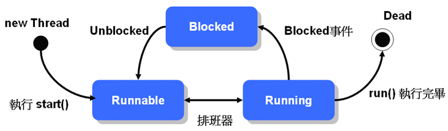

Concurrency
======
## Outline

- [前言](#前言)

- [Thread介紹](#Thread介紹)
	+ [Thread生命週期](#Thread生命週期)	
	+ [Tread優先權](#Thread優先權)
	+ [Thread的使用方法](#Thread的使用方法)
		* [繼承Thread類別](#繼承Thread類別)
		* [實做Runnable介面](#實做Runnable介面)
	+ [Daemon執行緒](#Daemon執行緒)
	+ [Thread的加入(Join)](#Thread的加入(Join))
	+ [Thread的停止](#Thread的停止)
	+ [ThreadGroup](#ThreadGroup)
	+ [使用Executors](#使用Executors)
	
- [參考文獻](#參考文獻)

## 前言

單執行緒程式指的是，當我們啟動一個Java程式，而這個Java程式在『同時間只會做一件事』。而多執行緒(Multi-thread）程式
指的是程式『同時間做很多事』，例如Web瀏覽程式可以在下載網頁的同時，顯示動畫、播放音樂、捲動式窗瀏覽網頁內容。
本章除了討論要如何實做Thread程式，也會探討如執行緒生命週期、執行緒安全(Thread-safe)，和同步化（Synchronized）等問題。


## Thread介紹
首先，先來釐清什麼是program、process、thread。

Program : 一群程式碼的集合，用以解決特定的問題。以物件導向的觀念來類比，相當於Class。


Process : Program載入記憶體後所產生的可執行檔，一個Program可以同時執行多次,產生多個Process。以物件導向的觀念來類比，相當於Object。
每一個process由以下兩個項組成：
- 一個Memory Space。相當於Object的variable,不同Process的Memory Space也不同,彼此看不到對方的Memory Space。
- 一個以上的Thread。Thread代表從某個起始點開始(例如main),到目前為止所有函數的呼叫路徑,以及這些呼叫路徑上所用到的區域變數。


Thread : 又稱為(Lightweight Process)，是process裡單一而連續的控制流程(flow of control)，一個process可以同時包含多個thread，稱為multi-thread
也就是說一個程式可同時進行多個不同的子流程，每個子流程可以得到一小段程式的執行時間，每執行完一個thread就跳下一個thread，
由於轉換的速度很快，看起來就像一個程式可以同時處理多個事務。每個thread都有一個優先值(priority)，priority較高的先執行。
每一個thread由以下兩項組成：
- Stack:紀錄函數呼叫路徑，以及這些函數所用到的區域變數。
- 目前CPU的狀態	


整理Thread的重點如下：
- 一個process可有多個thread，這些thread共用process的memory space，但每個thread有各自的stack。
- Thread不能單獨存在或獨立執行，一定隸屬於程式，由程式來啟動thread。
- 作業系統會根據thread的優先權以及已經用掉的CPU時間,在不同的thread作切換,讓各個thread都有機會執行。
- main()方法就是一個thread，所以每個process一定至少包含一個thread。 

### Thread生命週期

下圖是基本的Thread生命週期狀態：



當實例化一個 Thread 並執行 start() 之後，執行緒進入 Runnable 狀態，此時執行緒尚未真正開始執行，必須等待排班器（Scheduler）的排班，被排入執行的執行緒才會執行 run() 方法中的定義。

雖然執行緒看起來像是同時執行，但事實上同一時間點上，還是只有一個執行緒在動作，只是執行緒之間切換的動作很快，所以看來像是同時執行。

有幾種狀況會讓執行緒進入 Blocked 狀態：
- 等待輸入輸出完成
- 呼叫 sleep() 方法
- 嘗試取得物件鎖定
- 呼叫 wait() 方法

當執行緒因為等待使用者的文字輸入、傾聽網路連線或以上等情況時，會阻止它的執行而進入 Blocked 狀態，執行緒排班器將不分配執行時間給這個執行緒，直到以下的幾個對應情況讓執行緒回到 Runnable 狀態：
- 輸入輸出完成
- 呼叫 interrupt()
- 取得物件鎖定
- 呼叫 notify() 或 notifyAll()

最後，如果執行的工作完成（或發生例外）而離開 run() 方法，則執行緒執行完畢，進入 Dead 狀態，您可以使用 isAlive() 方法來測試執行緒是否存活。

### Thread優先權
Thread.setPriority(int)可以設定Thread的優先權,數字越大優先權越高。
您可以使用 Thread 的 setPriority() 方法來設定執行緒的優先權，設定必須在 1 到 10 之間，否則會丟出 IllegalArgumentException。
Thread定義了3個相關的static final variable
- public static final int MAX_PRIORITY 10
- public static final int MIN_PRIORITY 1
- public static final int NORM_PRIORITY 5 

當優先權有高有低的不同執行緒都進入生命週期中的Runnable狀態時(例如I/O輸入完畢)，JVM會先讓高優先權的執行緒執行，
但是在支援時間分割的作業系統下，優先權高的執行緒完成之前，較低優先權的執行緒仍然會分配到執行的時間。

使用優先權時，有件事要注意：
java分成十種優先權等級，但是各種作業系統的優先權分級未必和java相同，例如Windows就只有七種。
實際運作時，JVM會將程式重新對映到作業系統的優先權等級。
因此不同的優先權重新對映後有可能會沒有差別，如果執行緒的優先權一定要實質差距，可以使用上面提到的MAX、NORM、MIN來設定。

若是優先權相同時則依排程演算法輪流執行，如使用Round-Robin。
- 註(Round-Robin演算法)：首先，作業系統會定義一個時間單位，稱作time quantum或是time slice，長度通常在10~100毫秒。當程序(process)準備好能執行時(Ready)，會排入一個佇列(queue)的尾端，這佇列稱為ready queue。 CPU排程器會不斷地取出排在ready queue前端的程序，並且設定計時器在一個時間單位之後，自動去中斷程序。 

### Thread的使用方法
想要讓物件能具有多執行緒（Multi-thread）功能，只要繼承 java.lang.Thread 類別或是實作 java.lang.Runnable 介面。

#### 繼承Thread類別
在 Java 中要實現執行緒功能，可以繼承 java.lang.Thread 類別，並重新定義 run() 方法，
要使用時則new一個執行緒物件，然後使用 start() 方法啟動該執行緒。

範例1：
```java
package DemoThread;

class Person extends Thread{
	public Person(String name) { // name會成為新thread的名稱
		super(name) ; 
	}
	
	public void run() {
		String name = Thread.currentThread().getName(); // 取得thread的名稱
		int priority = Thread.currentThread().getPriority() ; // 取得thread的優先序
		Thread.State state = currentThread().getState() ; // 取得thread的狀態
		
		System.out.println(name + "的優先序:" + priority + "; 狀態:" + state ) ;
		
		for( int i = 1 ; i <= 5 ; i++ ) {
			System.out.println(name + "跑完第" + i + "圈") ;
			if ( name.equals("Ken") && i%3 == 0 ) { // Ken thread每跑三圈休息一秒
				System.out.println(name + "休息1秒") ;
				try{
					Thread.sleep(1000); // 暫停目前的thread1000毫秒
				}
				catch (InterruptedException e) {
					e.printStackTrace();
				} // catch
			} // if
		} // for
	} // run()
} // Person

public class DemoSampleThread {

    public static void main(String[] args) {
    	Person allen = new Person("Allen") ;
    	Person ken = new Person("Ken") ;
    	
    	allen.start(); // 啟動thread，並呼叫run()方法
    	// allen.start() ; // 已經啟動不能再呼叫start()方法
    	// ken.run() ; // 直接呼叫run()而略過start()不會開啟新的thread，而是由主執行緒去執行run()內容
    	
    	ken.start();
    	System.out.println("執行緒個數:" + Thread.activeCount()) ;
    	// 要注意的是，每次的執行結果不一定相同
    }

}


```

當您使用 Thread.sleep() 讓執行緒暫停執行進入 Blocked 狀態，您可以使用 interrupt() 讓它離開 Blocked 狀態，
當使用 sleep() 暫時進入 Blocked 狀態而您 interrupt() 時，會丟出 java.lang.InterruptedException 例外物件。

#### 實做Runnable介面
在Java裡一次只能繼承一個類別，所以當我們已經繼承了某類別，就不能繼承Thread類別，
這時候我們可以實做 java.lang.Runnable 介面來定義具執行緒功能的類別，
使用時一樣要先產生 Thread 類別的實例，只是要拿實作 Runnable 介面的物件實例，當成 Thread 類別建構子的參數
可參考父類別Thread的建構子參數：
- Thread()
- Thread(String name)
- Thread(Runnable target)
- Thread(Runnable target, String name)


範例2:
```java
package DemoRunnable;

class Person implements Runnable {
	public void run() {
		String name = Thread.currentThread().getName() ;
		
		for ( int i = 1 ; i < 5 ; i++ ) {
			System.out.println(name + "跑完第" + i + "圈") ;
			if ( name.equals("Ken") && i%3 == 0 ) {
				System.out.println(name + "稍為暫停" ) ;
				Thread.currentThread().yield(); // 讓該執行續暫停一下，先讓其他執行緒執行
			} // if
		} // for
	} // run
} // Person

public class DempSampleRunnable {

	public static void main(String[] args) {
		Person allen = new Person() ; // Person類別實做Runnable介面，所以Person物件就是Runnable物件
		Person ken = new Person() ;
		Thread tAllen = new Thread( allen, "Allen" ) ; // 呼叫Thread建構式，將Runnable物件allen傳入已建立Thread物件tAllen
		Thread tKen = new Thread( ken, "Ken" ) ;
		tAllen.start(); // 開啟執行緒並執行run方法
		tKen.start(); 
		
		try { // 主執行緒必須等到tAllen、tKen執行完畢才可以繼續進行
			tAllen.join();
			System.out.println("Join tAllen.") ;
			
			tKen.join();
			System.out.println("Join tKen.") ;
		}
		catch( InterruptedException e ) {
			e.printStackTrace();
		}
		
		System.out.println("跑步訓練結束") ;

	}

}

```

### Daemon執行緒
Daemon這個字的原意是在UNIX系統下獨立在幕後執行的程式，在Java的多執行緒設定中借用為背景執行緒。 
Daemon執行緒和一般執行緒只有一個差別，那就是當JVM底下只剩Daemon執行緒在運作時，JVM會直接關閉。JVM關閉之後，這些Daemon執行緒當然也會隨之結束。
換句話說，Daemon執行緒不能單獨生存在沒有一般執行緒的環境下。除此之外，Daemon執行緒和一般執行緒完全沒有任何差別。

範例3:
```java
package DemoDaemonThread;

public class DemoDaemonThread {

    public static void main(String[] args) {

    	System.out.println("Main Start.") ;
        Thread thread = new Thread(
        // 這是匿名類別的寫法
            new Runnable() {
                public void run() { 
                    while(true) { 
                        System.out.print("T"); 
                    } 
                }        
            }); 
        
        // 設定為Daemon執行緒
        thread.setDaemon(true); 
        thread.start(); 
        System.out.println("Main End.") ;
    }

}

```

這個程式在主執行緒結束之後，Daemon 執行緒也就會跟著結束，您可以使用 setDaemon() 方法來設定一個執行緒是否為 Daemon 執行緒，
如果沒有使用 setDaemon() 設定為 true，則程式會不斷的印出 'T' 字元而不終止；使用 isDaemon() 方法則可以判斷該執行緒是否為 Daemon 執行緒。

Java 預設所有從 Daemon 執行緒產生的執行緒也是 Daemon 執行緒，因為基本上由一個背景服務執行緒衍生出來的執行緒，
也應該是為了在背景服務而產生的，所以在產生它的執行緒停止的話，也應該一併跟著停止。


### Thread的加入

如果有一個A執行緒正在運行，您希望插入一個B執行緒，並要求 B 執行緒先執行完畢，然後再繼續 A 執行緒的流程，
可以使用 join() 方法來完成這個需求，當執行緒使用 join() 加入至另一個執行緒時，另一個執行緒會等待這個被加入的執行緒工作完畢，
然後再繼續它的動作，join() 的意思表示將執行緒加入成為另一個執行緒的流程之一。

範例4:
```java
package DemoThreadJoin;

public class DemoThreadJoin {

    public static void main(String[] args) {
        System.out.println("Thread A 執行");

        Thread threadB = new Thread(new Runnable() { 
            public void run() { 
                try { 
                    System.out.println("Thread B 開始.."); 
                    for(int i = 0; i < 5; i++) { 
                        Thread.sleep(1000); 
                        System.out.println("Thread B 執行.."); 
                    }
                    System.out.println("Thread B 即將結束.."); 
                } 
                catch(InterruptedException e) { 
                    e.printStackTrace(); 
                } 
            } 
        });

        threadB.start();

        try {
            // Thread B 加入 Thread A
            threadB.join();
        } 
        catch(InterruptedException e) { 
            e.printStackTrace(); 
        } 

        System.out.println("Thread A 執行");
    }

}

```
程式啟動後主執行緒就開始，在主執行緒中您新建 threadB，並在啟動 threadB 後，將之加入（join）主執行緒的流程之中，
所以 threadB 必須先執行完畢，主執行緒才會再繼續它原本的流程，如果程式中 threadB 沒有使用 join() 將之加入主執行緒的流程中，
則最後一行顯示 "Thread A 執行" 的陳述會先執行完畢（因為 threadB 使用了 sleep()，這讓主執行緒有機會取得時間來執行）。 
有時候加入的執行緒有可能處理太久，您不想無止境的等待這個執行緒的工作完畢，則您可以在 join() 上指定時間，
例如 join(10000)，表示加入成為流程之一的執行緒至多處理 10000 毫秒，也就是 10 秒，如果加入的執行緒還沒執行完畢就不理它了，
目前的執行緒可以繼續執行原本的工作流程。

### Thread的停止
如果您想要停止一個執行緒，您最好自行實作，一個執行緒要進入 Dead 狀態，就是執行完 run() 方法，簡單的說，如果您想要停止一個執行緒的執行，
就要提供一個方式讓執行緒可以完成 run() 的流程， 而這也是您自行實作執行緒停止的基本概念。

```java
public class SomeThread implements Runnable { 
    private boolean isContinue = true; 
    public void terminate() { 
        isContinue = false; 
    } 
    public void run() { 
        while(isContinue) { 
            // ... some statements 
        } 
    } 
}
```


如果執行緒因為執行 sleep() 而進入 Blocked 狀態，而您想要停止它，您可以使用 interrupt()，而程式會丟出 InterruptedException 例外，因而使得執行緒離開 run() 方法。

```java
public class SomeThread implements Runnable {
    public void run() { 
        System.out.println("sleep....至 blocked 狀態"); 
        try { 
            Thread.sleep(9999); 
        } 
        catch(InterruptedException e) { 
            System.out.println("I am interrupted...."); 
        } 
    } 

    public static void main(String[] args) { 
        Thread thread = 
                 new Thread(new SomeThread()); 
        thread.start(); 
        thread.interrupt(); 
    } 
}
```

### ThreadGroup
在 Java 中每個執行緒都屬於某個「執行緒群組」（ThreadGroup）管理的一員，例如若您是在 main() 主工作流程中產生一個執行緒，則產生的執行緒屬於 main 這個執行緒群組管理的一員，
您可以使用下面的指令來取得目前執行緒所屬的執行緒群組名稱：

```java
Thread.currentThread().getThreadGroup().getName();
```

每一個執行緒產生時，都會被歸入某個執行緒群組，這視您的執行緒是在哪個群組中產生，如果沒有指定，則歸入產生該子執行緒的執行緒群組中，您也可以自行指定執行緒群組，執行緒一但歸入某個群組，就無法更換群組。

java.lang.ThreadGroup 類別正如其名，可以統一管理整個群組中的執行緒，您可以使用以下的方式來產生群組，並在產生執行緒的時候，一併指定其群組：


```java
ThreadGroup threadGroup1 = new ThreadGroup("group1");
ThreadGroup threadGroup2 = new ThreadGroup("group2");
Thread thread1 = 
          new Thread(threadGroup1, "group1's member");
Thread thread2 = 
           new Thread(threadGroup2, "group2's member");
```

ThreadGroup 中的某些方法，可以對所有的執行緒產生作用，例如 interrupt() 方法可以 interrupt 群組中所有的執行緒，setMaxPriority() 方法可以設定群組中執行緒所能擁有的最大優先權（本來就擁有更高優先權的執行緒不受影響）。

如果您想要一次取得群組中所有的執行緒來進行某種操作，您可以使用 enumerate() 方法，例如：
```java
Thread[] threads = new Thread[threadGroup1.activeCount()];
threadGroup1.enumerate(threads);
```

activeCount() 方法取得群組中作用中的執行緒數量，enumerate() 方法要傳入一個 Thread 陣列，它會將執行緒物件設定至每個陣列欄位中，之後您就可以指定陣列索引來操作這些執行緒。

### 使用Executors
Thread Pool 的概念如同其名，就是一個 Thread 的 Pool，
其中有固定或變動量的 Thread，當 request 進來時，若有閒置的 Thread 就執行，
若沒有的話，可能產生新的 Thread 或把 request 放入 queue 中等待被執行，
當一條 Thread 執行完工作而 queue 中仍有 request 在等待時，
此 Thread 應該要被分發新的 request 並處理。

由以上幾行，我們可以看出 Thread Pool 的工作有：
- 管控 Thread 的產生與回收
- 分發 Thread 處理 request
- 處理 request 的 queue

使用Executors能為你管理Thread物件，進而簡化並行程式設計撰寫。Executors提供的是用戶端與執行任務之間的中介層，讓中介物件
執行任務，而不是讓用戶端直接執行。Executors可以讓你管理非同步任務的執行，而無需自行管理Thread的生命週期。

範例5:
```java
package DemoExecutor ;

import java.util.concurrent.Executor;
import java.util.concurrent.Executors;
 
 public class ThreadPoolDemo {
 
     public static void main(String[] args) {
         
         // 建立 2 個 thread 的 thread pool
         Executor executor = Executors.newFixedThreadPool(2);  
         
         // 執行實作了 Runnable 介面的內部類別 Work
         executor.execute(new Work(1));  
         executor.execute(new Work(2));  
         executor.execute(new Work(3));  
 
         // 直接在 function 中宣告匿名內部類別
         executor.execute(new Runnable() {
             // anonymous inner class            
             @Override
             public void run() {
                 System.out.println(Thread.currentThread().getName() + 
                     " Begins Work in anonymous inner class.");  
             }
         });
     }
     
     public static class Work implements Runnable {  
         private int id;  
       
         public Work (int id) {  
             this.id = id;  
         }  
       
         public void run() {  
             System.out.println(Thread.currentThread().getName() + 
                 " Begins Work " + id);  
             try {  
                 Thread.sleep(1000);  
             }  
             catch (InterruptedException ex) {  
                 ex.printStackTrace();  
             }  
             System.out.println(Thread.currentThread().getName() + 
                 " Ends Work " + id);  
         }  
     }  
 }
```

由以上的程式中我們可以發現，
Thread Pool 的 Thread 生命週期、request queue、分發request 都被 Java 做掉了，
我們所要做的就只有設定 Thread 的數量和專注在工作的內容。

另外除了固定 Thread 數量的 Thread Pool 可用 Executors.newFixedThreadPool() 外，
Executors 也提供了其他的 method 來產生不同的 Thread Pool，如：
- SingleThreadExecutor
- CachedThreadPool
- ScheduledThreadPool
- SingleThreadScheduledExecutor 


## 參考文獻

- [JavaSE6Tutorial-CH15](https://github.com/JustinSDK/JavaSE6Tutorial/blob/master/docs/CH15.md#%E7%AC%AC-15-%E7%AB%A0-%E5%9F%B7%E8%A1%8C%E7%B7%92thread)
- [Thread執行緒](http://programming.im.ncnu.edu.tw/J_Chapter9.htm)
- [Java多執行緒程式設計](http://eoffice.im.fju.edu.tw/phpbb/viewtopic.php?t=6280)
- [Java的執行緒PPT](http://dns2.asia.edu.tw/~wzyang/slides/Java_net/ch16.pdf)
- [JAVA SCJP6.0教戰手冊 CH13]


